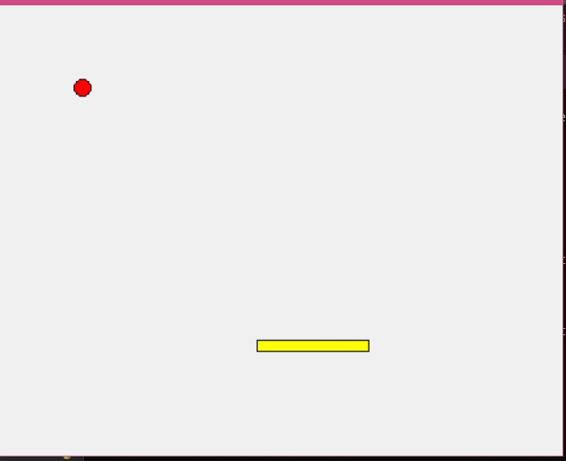

# Аркада

## Описание
Аркада - это простая аркадная игра, в которой игрок управляет платформой, чтобы поймать падающий шар. Игра помогает развивать реакцию и координацию. Избегайте падения шара, управляя платформой, чтобы он не коснулся нижней границы экрана!

## Установка
Для запуска игры вам потребуется Python 3 и библиотека Tkinter. Убедитесь, что у вас установлен Python. 

Также требуется модуль pygame: 

Установить Pygame на Python: 

Развернуть среду программирования Python  

Установить Pygame с помощью команды:

      ```bash
      pip install pygame.
      ```

Для Ubuntu и родственных дистрибутивов:  

    ```bash
    python3 -m pip install -U pygame --user
    ```

Если pip не установлен, предварительно нужно выполнить команду: 

   ```bash
    sudo apt install python3-pip
    ``

Для Windows: 
 
   ```bash
    py -m pip install -U pygame --user
    ```

Для запуска игры выполните следующие шаги: 

1. Склонируйте этот репозиторий: 

   ```bash
   git clone https://github.com/glina002/arkada.git 
   ```

2. Перейдите в каталог проекта:

   ```bash
   cd arkada
   ```

4. Запустите игру:

   ```bash
   python3 arkada.py
   ```

## Правила
- Управляйте платформой, чтобы поймать падающий шар.
- Используйте стрелки влево и вправо для перемещения платформы.
- Если шар падает ниже платформы, игра окончена.

## Управление
- Стрелка влево: перемещение платформы влево.
- Стрелка вправо: перемещение платформы вправо.

## Скриншоты
